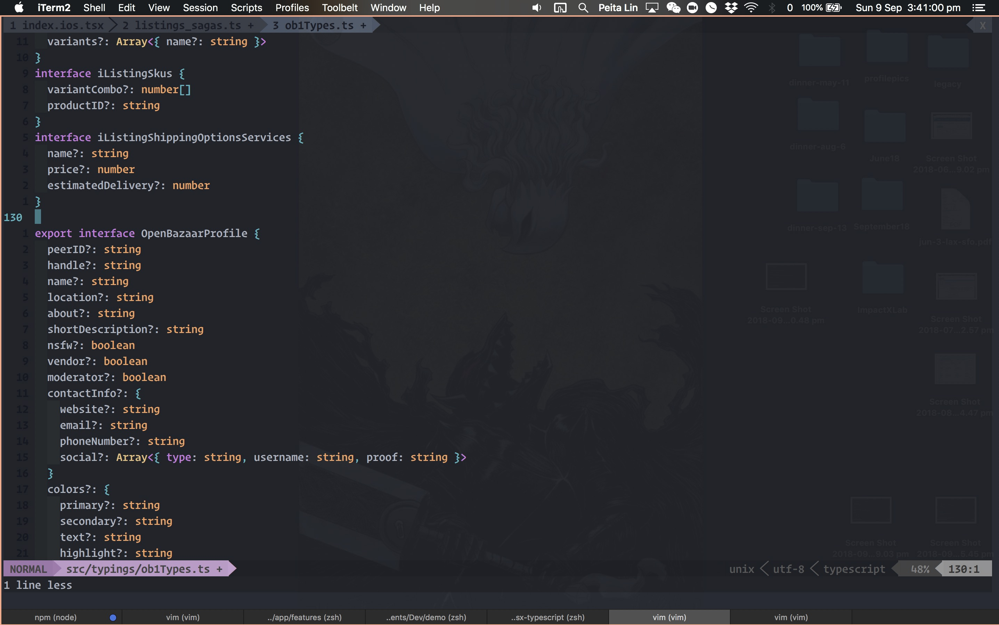
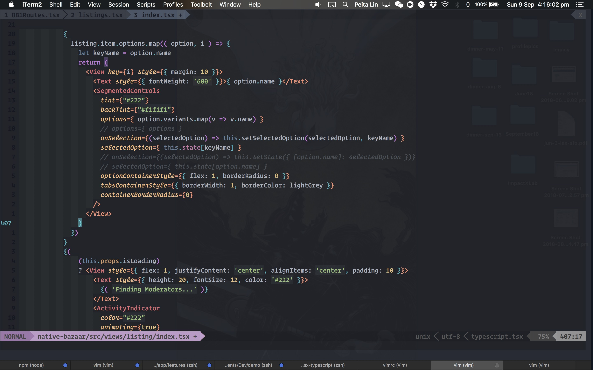

vim-jsx-typescript
=======

Syntax highlighting for JSX in Typescript.

vim-jsx-typescript is _not_ a JavaScript syntax package, so in order to use it, you will
also need to choose a base JS highlighter. `leafgarland/typescript-vim`[1] is the
recommended package.





## Installation

You need to install [Vundle] or [vim-plug]: `https://github.com/junegunn/vim-plug` --- just add the following lines to
your `~/.vimrc`:

### Vundle:

```
Plugin 'leafgarland/typescript-vim'
Plugin 'peitalin/vim-jsx-typescript'
```

### Vim-plug:

```
Plug 'leafgarland/typescript-vim'
Plug 'peitalin/vim-jsx-typescript'
```

To install from within vim, use the commands below.
```
:so ~/.vimrc
:PluginInstall

" OR for vim-plug:
:so ~/.vimrc
:PlugInstall

```

Note you can include .jsx files as typescript.tsx files for syntax highlighting.
```
" set filetypes as typescript.tsx
autocmd BufNewFile,BufRead *.tsx,*.jsx set filetype=typescript.tsx
```


Set jsx-tag colors in vimrc, for example:
```
" dark red
hi tsxTagName guifg=#E06C75

" orange
hi tsxCloseString guifg=#F99575
hi tsxCloseTag guifg=#F99575
hi tsxAttributeBraces guifg=#F99575
hi tsxEqual guifg=#F99575

" yellow
hi tsxAttrib guifg=#F8BD7F cterm=italic
```




Or use the blue-green [Original] colorscheme
```
" light blue
hi tsxTagName guifg=#59ACE5
" dark blue
hi tsxCloseString guifg=#2974a1
hi tsxCloseTag guifg=#2974a1
hi tsxAttributeBraces guifg=#2974a1
hi tsxEqual guifg=#2974a1
" green
hi tsxAttrib guifg=#1BD1C1

```


